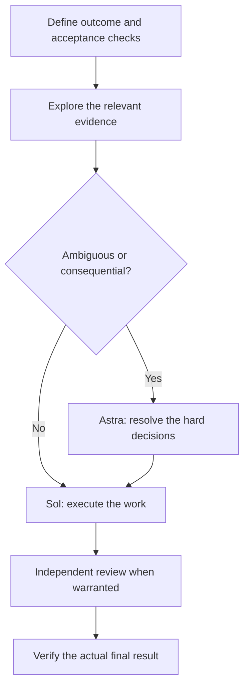

# ChatGPT Agent Team Guide

### The right model. A clear job. A result you can verify.

A practical field guide to choosing **GPT-6 Astra, Sol and Luna**, assigning work to specialist agents, and producing useful work across software, research, operations and design.

**Checked against official documentation: 29 September 2026.** Recommendations are starting points to evaluate on your own tasks, not benchmark results or guarantees. This is an independent guide by [dextee](https://github.com/dextee), not an OpenAI publication.

Maintained by **[Dexter Ng](https://github.com/dextee), CTO & Cybersecurity Lead at [VYR](https://vyrwork.com/about)**. [Explore VYR Agent OS](https://vyrwork.com/agent-os?utm_source=github&utm_medium=referral&utm_campaign=chatgpt_agent_guide&utm_content=guide_intro) · [Work with VYR](WORK_WITH_VYR.md).

<p align="center"></p>

*Conceptual artwork, not a product screenshot or customer deployment. [Generation method and gallery](assets/README.md).*

**Start with Sol for everyday work. Use Luna for small, repeatable jobs. Bring in Astra when ambiguity, reasoning depth or the consequences of a mistake justify it.** Use an image model when the deliverable is an image.

| I want to… | Start here |
|---|---|
| Pick a model for today's task | [24-task selector](docs/task-selector.md) |
| Understand the models, effort and cost | [Model guide](docs/models-and-effort.md) |
| Set up a reusable team | [Setup instructions](SETUP.md) |
| Copy a complete workflow prompt | [Workflow recipes](docs/workflows.md) |
| Use this in ChatGPT rather than a terminal | [Choose your product](docs/product-surfaces.md) |
| Create better images | [Visual production guide](docs/image-workflow.md) |
| Check the evidence and limitations | [Sources](SOURCES.md) · [Validation](VALIDATION.md) |
| Apply this to a business process | [Scope a workflow with VYR](WORK_WITH_VYR.md) |

## Choose in 30 seconds


| Model | Our starting use | Example |
|---|---|---|
| **GPT-6 Luna** | Clear instructions, narrow scope, easy checks | Extract fields, classify requests, locate files, make a mechanical edit |
| **GPT-6 Sol** | Everyday work that needs judgment and follow-through | Implement a feature, research a decision, produce a proposal, operate an app |
| **GPT-6 Astra** | Ambiguous problems and demanding synthesis | Resolve competing explanations, design a migration, review a consequential change |
| **GPT Image 2.5 Flare** | Fast visual exploration | Generate several creative directions |
| **GPT Image 2.5 Sunburst** | Demanding image quality and precise editing | Refine a final hero or preserve details across edits |

The general model positioning comes from [OpenAI's selection guide](https://developers.openai.com/api/docs/guides/model-selection); image choices come from the [image prompting guide](https://developers.openai.com/api/docs/guides/image-prompting). Our scenario assignments are editorial recommendations.

**Product matters:** GPT-6 Sol and Luna are available in **Work and Codex**, subject to access, rather than ordinary Chat. A role prompt does not select a model or create independent agents by itself. [Check your product first](docs/product-surfaces.md).

## The recommended team

Use **Sol / medium** as the everyday lead. Start a specialist only when its output will change the next action. You do not need all nine on every task.


| Agent | Model / effort | Job and output |
|---|---|---|
| [Architect](agents/guide_architect.toml) | Astra / high | Resolve ambiguity; return a plan, tradeoffs and acceptance checks |
| [Implementer](agents/guide_implementer.toml) | Sol / medium | Complete a feature; return changed files and relevant verification |
| [Worker](agents/guide_worker.toml) | Luna / medium | One mechanical or tightly specified task with an objective check |
| [Explorer](agents/guide_explorer.toml) | Luna / high | Read-only search; return paths, symbols and useful evidence |
| [Reviewer](agents/guide_reviewer.toml) | Sol / high | Routine independent review; return reproducible findings |
| [Auditor](agents/guide_auditor.toml) | Astra / high | Demanding final review across requirements and evidence |
| [Researcher](agents/guide_researcher.toml) | Sol / high | Collect sources, reconcile claims and flag uncertainty |
| [Editor](agents/guide_editor.toml) | Sol / medium | Turn verified material into clear audience-appropriate writing |
| [Visual director](agents/guide_visual_director.toml) | Sol / medium | Specify and review artwork; invoke an available image tool |

These are local Codex agent definitions. Their files explicitly set both model and effort. Agent configuration does not grant model access, browser permission or an image-generation tool. [Setup and configuration behavior](SETUP.md).

### The everyday loop



Parallelize independent research or separate files. Keep dependent steps in order. Give one agent ownership of each shared writable file, browser session or external record.

## Install the reusable agents

Requires a current local Codex client and Python 3.11+. Review the installer first; it copies agent files, backs up changed destinations and leaves your main configuration alone.

```bash
git clone https://github.com/dextee/chatgpt-agent-team-guide.git
cd chatgpt-agent-team-guide
python scripts/install_agents.py --project /path/to/your/project --dry-run
python scripts/install_agents.py --project /path/to/your/project
```

On Windows, use `py -3.12` in place of `python` if needed, and quote paths containing spaces. [Full setup, personal installation and rollback](SETUP.md).

Then ask Codex:

```text
Use guide_explorer to map the code involved in this feature. Have
guide_implementer build the change, then ask guide_reviewer to inspect it
independently. Keep the requirements and final verification in the main thread.
```

## Choose the smallest useful team

| Situation | Suggested arrangement |
|---|---|
| Small edit with clear instructions | One Luna or Sol session |
| Everyday implementation | Sol lead; Luna explorer; Sol reviewer if needed |
| Complex feature or migration | Sol lead; Astra architect; scoped workers; Astra auditor |
| Research brief | Sol lead; researchers split by question; editor after evidence is ready |
| Ambiguous incident | Astra lead; separate evidence investigations; one owner for remediation |
| Visual campaign | Sol visual director; image tool for assets; editor checks copy and fit |

This guide's team sizes and role assignments are hypotheses to test. More agents can increase coordination work and total token consumption. [Subagent behavior](https://learn.chatgpt.com/docs/agent-configuration/subagents).

## Recipes you can use today


The [recipe library](docs/workflows.md) includes feature delivery, hard bugs, research, proposals, data reconciliation, browser administration, refactors, creative campaigns, document repair, support triage, repository audits and budget-sensitive automation. Each gives you a recommended model, handoff and completion check.

### A better delegation brief

```text
Outcome: [the result required]
Context: [only the sources and decisions needed]
Owner: [one agent / one writable area]
Model and effort: [when your product supports selecting them]
Scope: [files, pages, records or questions]
Acceptance: [observable checks]
Return: [result, evidence, unresolved issues, recommended next action]
```

For local custom agents, the file's model settings take precedence. Use another role or edit its configuration deliberately if you need a different model; do not assume a conflicting sentence in your prompt overrides the file. [Configuration details](SETUP.md#model-selection-precedence).

## Keep quality and cost visible

- Evaluate the finished task: accuracy, completeness, rework, elapsed time and actual usage.
- Start with one agent when the work is short or sequential.
- Use an escalation trigger: unclear requirements, conflicting evidence, repeated failure or a consequence that deserves stronger review.
- Check permissions and tool availability before attributing a failure to the model.
- Set a task budget and stop adding reviews once the acceptance checks are satisfied.

Use the [evaluation worksheet](templates/evaluation.csv) and [cost guide](docs/cost-and-evaluation.md). API list prices and subscription limits are different measures; this guide does not estimate your subscription quota from API prices.

## Relationship to the Claude guide

This companion follows the original five-role pattern: architect, implementer, worker, explorer and auditor. It adds roles for research, editing, visual direction and routine review. The historical Claude guide is preserved at [its original Git commit](https://github.com/dextee/vyr-agent-os-workflows/tree/d227750cba963e48eb38035d84c5d339c2d7f877). Its old repository name now redirects to the VYR showcase.

The OpenAI recommendations were researched independently. Claude's `/advisor`, plugin format and model aliases are not copied into Codex configuration. [Translation notes](docs/from-claude.md).

## Apply the approach with VYR

The [VYR Agent OS showcase](https://github.com/dextee/vyr-agent-os-workflows) translates agent workflows into business examples. Its internal operations, sample-data demo and custom-build designs carry separate status labels. Its savings scenarios are illustrative.

For a potential implementation, share the recurring task, current tools, monthly volume, budget range and target start date. **[See the process and send a workflow brief](WORK_WITH_VYR.md)** · [Review current Agent OS status](https://vyrwork.com/agent-os?utm_source=github&utm_medium=referral&utm_campaign=chatgpt_agent_guide&utm_content=guide_business).

This guide is an educational resource maintained alongside Dexter’s commercial work at VYR. The model recommendations are not evidence of VYR customer outcomes or an OpenAI endorsement.

## Artwork and maintenance

Original illustrations were generated with the built-in image tool. The exact backend model was not exposed; **these assets are not represented as verified GPT Image 2.5 output**. [Gallery and provenance](assets/README.md).

For corrections, include the official source, the affected task and the date checked. See [contributing](CONTRIBUTING.md) and the [source register](SOURCES.md). Model access and interfaces can change after the verification date.
